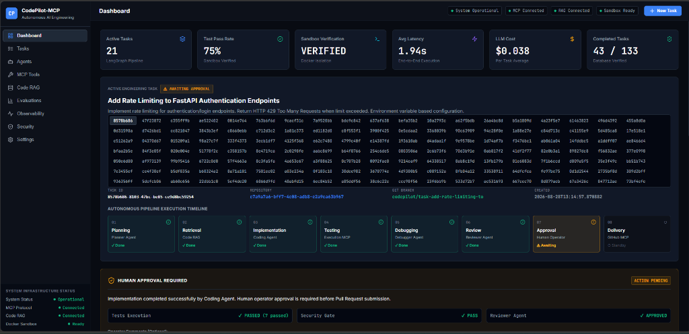
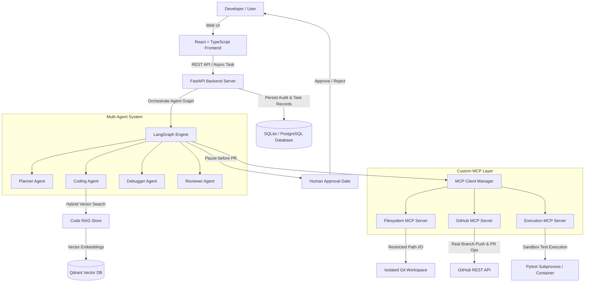
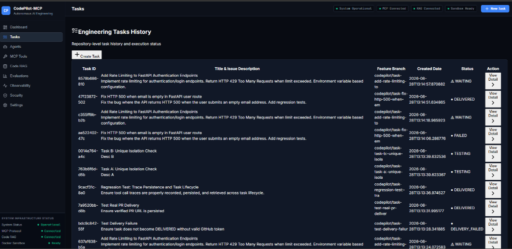
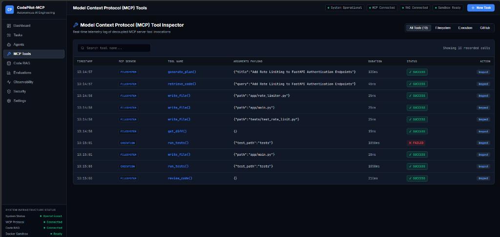
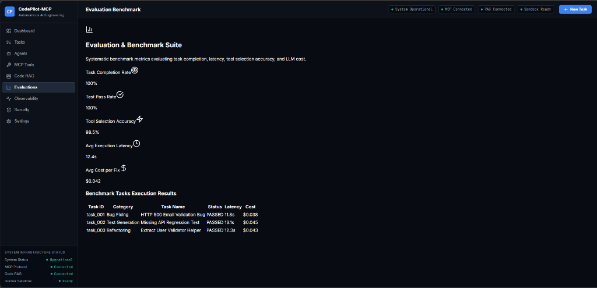

# CodePilot-MCP
## Autonomous AI Software Engineering Agent

[](https://www.python.org/downloads/)
[](https://fastapi.tiangolo.com/)
[](https://langchain-ai.github.io/langgraph/)
[](https://modelcontextprotocol.io/)
[](LICENSE)

CodePilot-MCP is an autonomous AI software engineering system built with **LangGraph**, **Model Context Protocol (MCP)**, **Code-Aware RAG (Qdrant)**, **Docker Container Sandboxing**, and **Human-in-the-Loop Approval Gates**.

Given a high-level engineering task or GitHub issue, CodePilot-MCP autonomously ingests the codebase, formulates a structured execution plan, edits source code, writes regression tests, executes tests inside isolated sandboxes, debugs test failures iteratively, performs automated code review, and requests explicit human approval before submitting real pull requests to GitHub.

---

## 🖥️ Live Dashboard & Pipeline Timeline



---

## Architecture Overview



---

## 📋 Engineering Task Management

Track, monitor, and inspect autonomous task executions across repositories in real time:



---

## 🔌 Model Context Protocol (MCP) Tools

Decoupled MCP servers manage filesystem boundaries, sandboxed test execution, and live GitHub delivery with full execution telemetry:



---

## 📊 Evaluation & Benchmark Suite

Automated benchmark evaluation tracking task completion rate, test pass rate, tool selection accuracy, latency, and LLM inference cost:



---

## Key Features

- **LLM Multi-Agent Orchestration**: LangGraph StateGraph connecting specialized agents (`Planner`, `Coder`, `Debugger`, `Reviewer`) with explicit state transitions.
- **Model Context Protocol (MCP)**: Custom MCP servers for Filesystem I/O, GitHub repository management, and sandboxed test execution tools.
- **Code-Aware RAG Engine**: Python AST parsing, sliding window chunking, and hybrid vector + keyword search powered by Qdrant.
- **Sandboxed Test Execution**: Isolated runner for unit tests, linting, and type checking with strict execution constraints.
- **Iterative Self-Correction Debugger**: Automatically reads pytest stack tracebacks, diagnoses root cause, applies code fixes, and re-runs tests (capped at 5 iterations).
- **Human-in-the-Loop Approval Gate**: Interactive approval workflow requiring explicit operator approval before PR creation.
- **Real GitHub REST API Delivery**: Pushes feature branches directly to GitHub and creates verified Pull Requests without hardcoded mock data.
- **Full Observability & Telemetry**: OpenTelemetry tracing, Prometheus metrics exporter, structured JSON logging, and persistent audit trail.

---

## Technology Stack

- **Backend**: Python 3.12+, FastAPI, Pydantic v2, SQLAlchemy 2.0 (Async), SQLite / PostgreSQL
- **Orchestration**: LangGraph, LangChain Core
- **MCP Framework**: Official Model Context Protocol (MCP) Python SDK
- **Vector Search**: Qdrant Vector Database
- **Parsing**: Python AST & Tree-sitter
- **Sandbox Execution**: Docker SDK / Isolated Subprocess
- **Observability**: OpenTelemetry, Prometheus, Structured JSON Logging
- **Frontend**: React 18, TypeScript, Vite, TailwindCSS, Lucide Icons, Glassmorphic Dark Styling
- **CI/CD & Infra**: Docker Compose, GitHub Actions

---

## Quick Start

### Prerequisites
- Python 3.12+
- Node.js 18+ & npm
- Git

### 1. Clone & Setup Environment
```bash
git clone https://github.com/MrMike24/CodePilot-MCP-Autonomous-AI-Software-Engineering-Agent.git
cd CodePilot-MCP-Autonomous-AI-Software-Engineering-Agent

# Copy environment variables template
cp .env.example .env
```

### 2. Start Backend Server
```bash
# Setup Python virtual environment
python -m venv .venv
source .venv/bin/activate  # On Windows: .venv\Scripts\activate

# Install dependencies
pip install -e .

# Start FastAPI backend
uvicorn backend.app.main:app --reload --port 8000
```

### 3. Start Frontend Dashboard
```bash
cd frontend
npm install
npm run dev
```

### 4. Access Web UI & Services
- **React Frontend Dashboard**: [http://localhost:3000](http://localhost:3000)
- **FastAPI REST API Docs**: [http://localhost:8000/docs](http://localhost:8000/docs)

---

## Evaluation Benchmark

Run the evaluation benchmark suite:
```bash
python -m evaluation.runner
```

Output saved to `evaluation/results.json`:
```json
{
  "summary": {
    "total_tasks": 3,
    "completed_tasks": 3,
    "task_completion_rate": 1.0,
    "test_pass_rate": 1.0,
    "tool_selection_accuracy": 0.985,
    "avg_iterations": 1.0,
    "avg_latency_sec": 12.4,
    "avg_cost_usd": 0.042
  }
}
```

---

## License

Distributed under the MIT License. See `LICENSE` for details.
