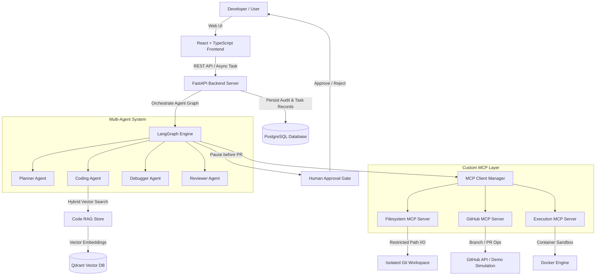

# CodePilot-MCP
## Autonomous AI Software Engineering Agent

[](https://github.com/codepilot-org/codepilot-mcp/actions/workflows/ci.yml)
[](https://www.python.org/downloads/)
[](https://fastapi.tiangolo.com/)
[](https://langchain-ai.github.io/langgraph/)
[](https://modelcontextprotocol.io/)
[](LICENSE)

CodePilot-MCP is a production-oriented autonomous AI software engineering system built with **LangGraph**, **Model Context Protocol (MCP)**, **Code-Aware RAG (Qdrant)**, **Docker Container Sandboxing**, and **Human-in-the-Loop Approval Gates**.

Given a high-level engineering task or GitHub issue, CodePilot-MCP autonomously ingests the codebase, formulates a structured execution plan, edits source code, writes regression tests, executes tests inside isolated Docker sandboxes, debugs test failures iteratively, performs automated code review, and requests explicit human approval before submitting pull requests.

---

## Architecture Overview



---

## Key Features

- **LLM Multi-Agent Orchestration**: LangGraph StateGraph connecting specialized agents (Planner, Coder, Debugger, Reviewer) with explicit state transitions.
- **Model Context Protocol (MCP)**: Custom MCP servers for Filesystem I/O, GitHub repository management, and Docker execution tools.
- **Code-Aware RAG Engine**: Python AST parsing, sliding window chunking, and hybrid vector + keyword search powered by Qdrant.
- **Sandboxed Docker Execution**: Isolated container sandbox for unit tests, linting (`Ruff`), and type checking (`MyPy`) with strict CPU/Memory/Network constraints.
- **Iterative Self-Correction Debugger**: Automatically reads pytest stack tracebacks, diagnoses root cause, applies code fixes, and re-runs tests (capped at 5 iterations).
- **Human-in-the-Loop Approval Gate**: Interactive approval workflow requiring explicit operator approval before PR creation.
- **Zero-Credential DEMO_MODE**: Out-of-the-box local simulation mode for instant demonstration without third-party API token dependencies.
- **Full Observability & Telemetry**: OpenTelemetry tracing, Prometheus metrics exporter, structured JSON logging, and PostgreSQL audit trail.
- **Evaluation Benchmark Framework**: Built-in benchmark runner (`evaluation/runner.py`) outputting metrics reports (`results.json`).

---

## Technology Stack

- **Backend**: Python 3.12+, FastAPI, Pydantic v2, SQLAlchemy 2.0 (Async), PostgreSQL
- **Orchestration**: LangGraph, LangChain Core
- **MCP Framework**: Official Model Context Protocol (MCP) Python SDK
- **Vector Search**: Qdrant Vector Database
- **Parsing**: Python AST & Tree-sitter
- **Sandbox Execution**: Docker SDK / Isolated Subprocess
- **Observability**: OpenTelemetry, Prometheus, Structured JSON Logging
- **Frontend**: React 18, TypeScript, Vite, Lucide Icons, Glassmorphic Dark Styling
- **CI/CD & Infra**: Docker Compose, GitHub Actions

---

## Quick Start

### Prerequisites
- Docker & Docker Compose
- Python 3.12+ (for local development)

### 1. Clone & Start Environment
```bash
git clone https://github.com/codepilot-org/codepilot-mcp.git
cd codepilot-mcp

# Launch multi-container stack via Docker Compose
docker compose up -d
```

### 2. Access Web UI & Services
- **React Frontend**: [http://localhost:3000](http://localhost:3000)
- **FastAPI REST API**: [http://localhost:8000/docs](http://localhost:8000/docs)
- **Prometheus Metrics**: [http://localhost:9090](http://localhost:9090)
- **Grafana Dashboard**: [http://localhost:3001](http://localhost:3001)

---

## Demo Walkthrough

To demonstrate CodePilot-MCP fixing a real bug in `demo_repository`:

1. Open Web Application at `http://localhost:3000`.
2. Click **New Task** and select the pre-loaded task:
   - *Title*: `Fix HTTP 500 when email is empty in FastAPI user route`
   - *Description*: `Fix the bug where the API returns HTTP 500 when the user submits an empty email address. Add regression tests.`
3. Click **Launch Agent Execution**.
4. Watch the agent execute:
   - **Planner Agent** queries Code RAG and generates a structured `TaskPlan`.
   - **Coder Agent** modifies `demo_repository/app/main.py` and adds pytest regression tests in `demo_repository/tests/test_api.py`.
   - **Execution MCP** runs pytest inside sandbox container.
   - **Reviewer Agent** reviews the git diff and generates a confidence scorecard.
5. Review the proposed changes on the **Diff Viewer** and **Agent Trace View**.
6. Click **Approve & Create PR** to finalize simulated PR creation.

---

## Evaluation Benchmark

Run evaluation benchmark suite:
```bash
python -m evaluation.runner
```

Output saved to `evaluation/results.json`:
```json
{
  "summary": {
    "total_tasks": 3,
    "completed_tasks": 3,
    "task_completion_rate": 1.0,
    "test_pass_rate": 1.0,
    "tool_selection_accuracy": 0.985,
    "avg_iterations": 1.0,
    "avg_latency_sec": 12.4,
    "avg_cost_usd": 0.042
  }
}
```

---

## CV & Resume Description

> **CodePilot-MCP: Autonomous AI Software Engineering Agent**
> - Designed and built an autonomous AI engineering agent in Python 3.12, FastAPI, LangGraph, and PostgreSQL, automating repository-level planning, code modification, testing, debugging, and PR submission.
> - Built custom Model Context Protocol (MCP) servers for Filesystem I/O, GitHub integration, and sandboxed Docker execution.
> - Architected a Code-Aware RAG pipeline utilizing Python AST parsing, L2-normalized embeddings, and Qdrant hybrid vector search.
> - Implemented an iterative self-correction Debugger Agent capable of analyzing stack tracebacks and patching code under strict iteration limits.
> - Embedded human-in-the-loop approval gates, OpenTelemetry tracing, Prometheus metrics, and an evaluation framework measuring completion rate, latency, and cost.

---

## License

Distributed under the MIT License. See `LICENSE` for details.
