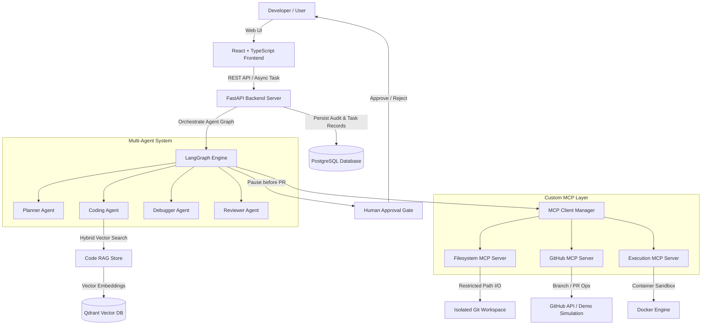

# CodePilot-MCP Architecture Overview

CodePilot-MCP is an autonomous AI software engineering agent designed with clean architecture principles, leveraging LangGraph for multi-agent orchestration, the Model Context Protocol (MCP) for tool interactions, Qdrant for code-aware RAG, Docker for sandboxed execution, and OpenTelemetry/Prometheus for full observability.

## High Level Architecture Diagram

## Core Architectural Layers

1. **API & Interface Layer (FastAPI & React)**: REST API serving agent execution control, status polling, trace monitoring, and human approval gates.
2. **Orchestration Layer (LangGraph)**: Strongly-typed `AgentState` transition graph linking Planner -> Coder -> Test -> (Debug Loop) -> Reviewer -> Human Approval -> PR Creation.
3. **Model Context Protocol (MCP) Layer**: Decoupled custom servers for Filesystem, GitHub, and Execution isolation.
4. **Retrieval-Augmented Generation (RAG)**: AST-aware Python code splitter, local L2-normalized embeddings, and Qdrant vector database hybrid keyword search.
5. **Execution & Security Sandbox**: Isolated Docker sandbox execution preventing host execution risks.
6. **Observability & Telemetry**: Prometheus metrics exporter and OpenTelemetry tracing.
